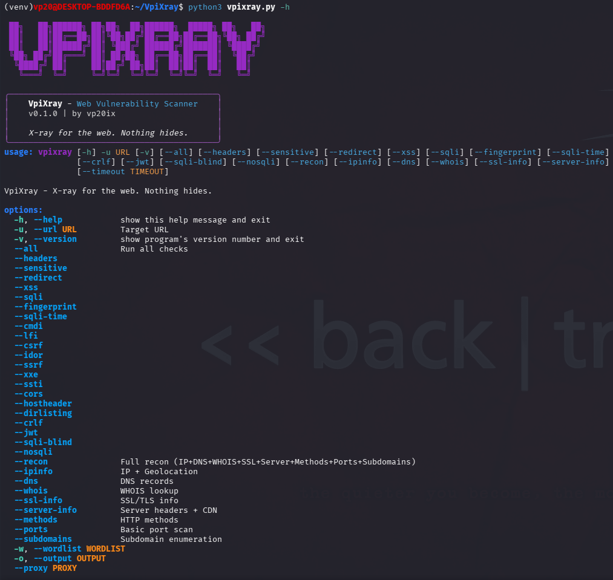
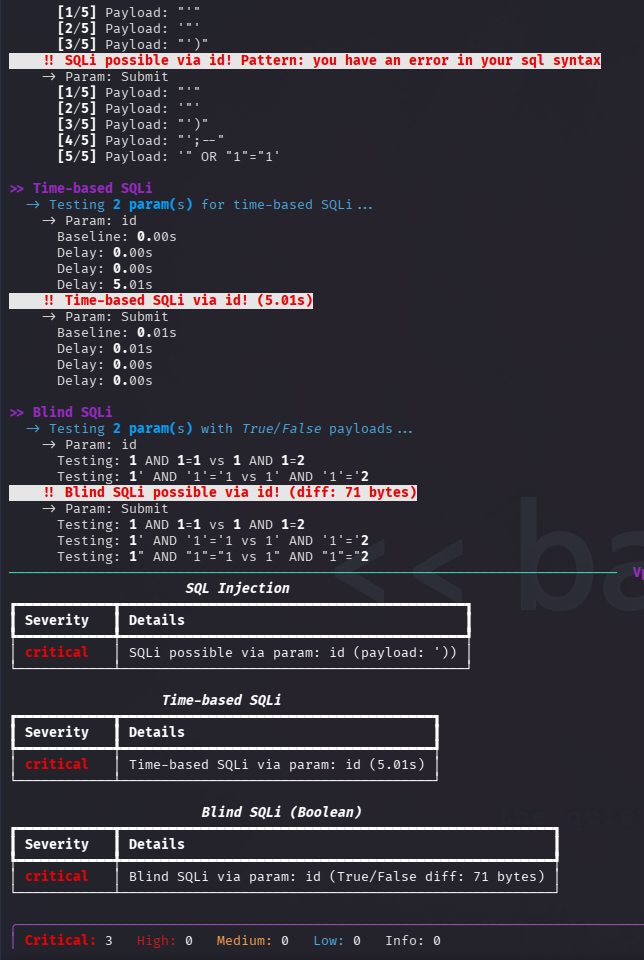
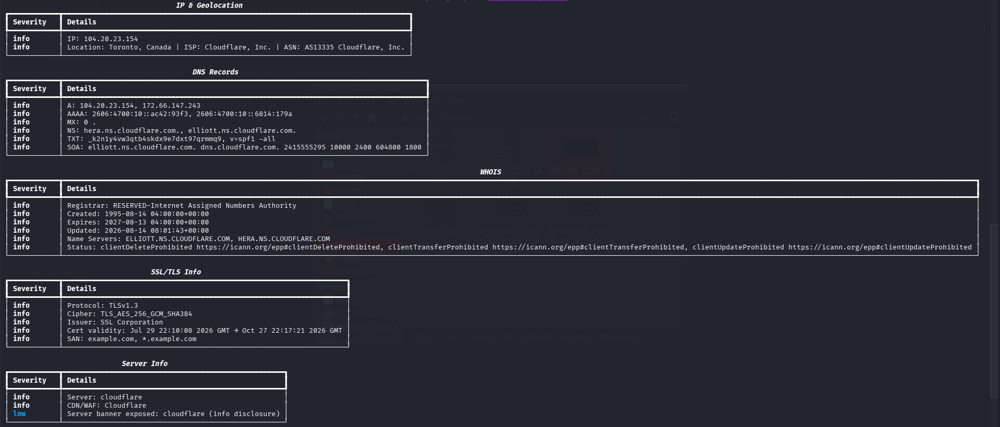

# 🩻 VpiXray

> X-ray for the web. Nothing hides.

Web vulnerability scanner + recon suite written in Python.
Built for penetration testers, bug bounty hunters, and security learners.

---

## Table of Contents

- [Features](#features)
- [Requirements](#requirements)
- [Quick Start](#quick-start)
- [Usage](#usage)
- [Command Options](#command-options)
- [Examples](#examples)
- [Architecture](#architecture)
- [FAQ](#faq)
- [Roadmap](#roadmap)
- [Contributing](#contributing)
- [Credits](#credits)
- [Legal Disclaimer](#legal-disclaimer)
- [Author](#author)
- [License](#license)

---

## Features

### Vulnerability Scanner (21 checks)

- SQL Injection (Error-based)
- Time-based SQLi
- Blind SQLi (Boolean)
- NoSQL Injection
- Command Injection
- SSTI (Server-Side Template Injection)
- SSRF (Server-Side Request Forgery)
- XXE (XML External Entity)
- LFI (Local File Inclusion)
- Reflected XSS
- CRLF Injection
- Host Header Injection
- CORS Misconfiguration
- Sensitive Files (.env, .git, backups)
- CSRF
- IDOR
- Directory Listing
- Open Redirect
- Security Headers
- JWT Analyzer
- Tech Fingerprint

### Recon Suite (8 checks)

- IP & Geolocation
- DNS Records
- WHOIS
- SSL/TLS Info
- Server Info + CDN detection
- HTTP Methods
- Port Scan (18 ports)
- Subdomain Enumeration

---

## Requirements

| Requirement | Details |
|-------------|---------|
| Python | 3.8 or higher |
| pip | Latest version |
| OS | Linux, macOS, Windows (WSL), Kali |
| Root access | Not required |
| API keys | Not required |

---

## Quick Start

Step 1: Clone the repository

    git clone https://github.com/vp20ix/VpiXray.git
    cd VpiXray

Step 2: Create virtual environment

    python3 -m venv venv
    source venv/bin/activate

Step 3: Install dependencies

    pip install -r requirements.txt

Step 4: Run the tool

    python3 vpixray.py -u https://target.com --all

---

## Usage

Full vulnerability scan:

    python3 vpixray.py -u https://target.com --all

Full recon suite:

    python3 vpixray.py -u https://target.com --recon

Recon + vulnerability scan:

    python3 vpixray.py -u https://target.com --recon --all

Specific checks:

    python3 vpixray.py -u https://target.com --sqli --xss --lfi

Export to JSON:

    python3 vpixray.py -u https://target.com --all -o report.json

With session cookie:

    python3 vpixray.py -u https://target.com --all --cookie "PHPSESSID=xxx"

Through a proxy:

    python3 vpixray.py -u https://target.com --all --proxy http://127.0.0.1:8080

---

## Command Options

### General

| Option | Description |
|--------|-------------|
| `-u, --url` | Target URL (required) |
| `--all` | Run all vulnerability checks |
| `--recon` | Run full recon suite |
| `-o, --output` | Export to JSON |
| `--cookie` | Session cookie |
| `--proxy` | Proxy URL |
| `--timeout` | Timeout in seconds |

### Vulnerability Checks

| Option | Check |
|--------|-------|
| `--sqli` | SQL Injection |
| `--sqli-time` | Time-based SQLi |
| `--sqli-blind` | Blind SQLi |
| `--nosqli` | NoSQL Injection |
| `--xss` | Reflected XSS |
| `--lfi` | Local File Inclusion |
| `--cmdi` | Command Injection |
| `--csrf` | CSRF |
| `--idor` | IDOR |
| `--ssrf` | SSRF |
| `--xxe` | XXE |
| `--ssti` | SSTI |
| `--cors` | CORS Misconfig |
| `--hostheader` | Host Header Injection |
| `--crlf` | CRLF Injection |
| `--jwt` | JWT Analyzer |
| `--dirlisting` | Directory Listing |
| `--headers` | Security Headers |
| `--sensitive` | Sensitive Files |
| `--redirect` | Open Redirect |
| `--fingerprint` | Tech Fingerprint |

### Recon Options

| Option | Check |
|--------|-------|
| `--ipinfo` | IP + Geolocation |
| `--dns` | DNS Records |
| `--whois` | WHOIS |
| `--ssl-info` | SSL/TLS Info |
| `--server-info` | Server Info |
| `--methods` | HTTP Methods |
| `--ports` | Port Scan |
| `--subdomains` | Subdomain Enum |

---

## Examples

### Example 1: Scan DVWA locally

    sudo docker run --rm -it -p 8080:80 vulnerables/web-dvwa
    python3 vpixray.py -u "http://localhost:8080/vulnerabilities/sqli/?id=1" --sqli --cookie "PHPSESSID=xxx"

Result: Detects SQL Injection.

### Example 2: Scan a legal test target

    python3 vpixray.py -u "http://testphp.vulnweb.com/artists.php?artist=1" --all

Result: Detects multiple vulnerabilities.

### Example 3: Recon only

    python3 vpixray.py -u "https://example.com" --recon

Result: Shows IP, DNS, SSL, server info, ports.

---

## Screenshots

### Main Interface

### Vulnerability Scan — SQL Injection Detection

### Recon Suite

## Architecture

    VpiXray/
    ├── vpixray.py              # Entry point
    ├── core/                   # Vulnerability checks
    ├── recon/                  # Reconnaissance modules
    ├── utils/                  # Utilities
    ├── wordlists/
    ├── requirements.txt
    ├── LICENSE
    └── README.md

---

## FAQ

### Does VpiXray require Kali Linux?
No. It runs on any Linux distribution, macOS, and Windows (via WSL).

### Do I need root access?
No. Regular user permissions are enough.

### Do I need API keys?
No. All services used are free.

### Is it legal to use?
Only on systems you own or have written permission to test.

### How long does a scan take?
Typically 30 seconds to 2 minutes.

### Can I use it in bug bounty?
Yes, but check the program's scope first.

### The scan is slow. How to speed up?
Use --timeout 3

### pip install fails with "externally-managed-environment"?
You must use a virtual environment.

---

## Roadmap

- [x] 21 vulnerability checks
- [x] 8 recon checks
- [x] JSON export
- [x] Cookie support
- [x] Proxy support
- [ ] HTML Dashboard
- [ ] CVSS Scoring
- [ ] AI Triage
- [ ] Plugin System
- [ ] Async Engine
- [ ] Multi-target
- [ ] Docker image
- [ ] PyPI package

---

## Contributing

Contributions are welcome.

1. Fork the repository
2. Create a feature branch
3. Commit your changes
4. Push to your branch
5. Open a Pull Request

Report bugs via GitHub Issues.

---

## Credits

Built with:
- requests
- rich
- beautifulsoup4
- dnspython
- python-whois

Inspired by: sqlmap, nuclei, nikto, nmap.

---

## Legal Disclaimer

**For authorized security testing ONLY.**

Never scan targets without written permission.

Safe targets:
- scanme.nmap.org
- Your own servers
- DVWA (local)
- PortSwigger Web Security Academy

---

## Author

**vp20ix** — https://github.com/vp20ix

---

## License

MIT License - see LICENSE file.
